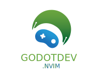
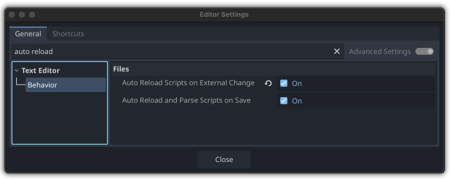
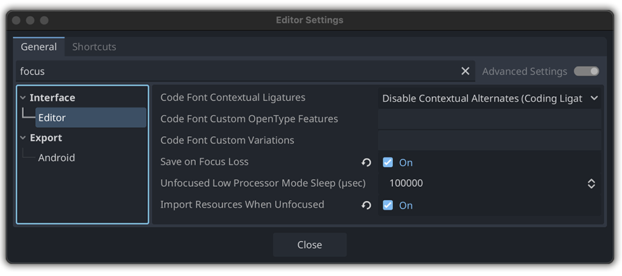
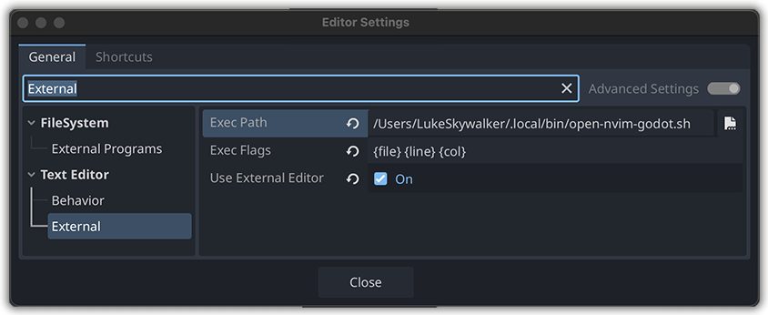

<div align="center"></div>

# godotdev.nvim

Neovim plugin for Godot game development, using Neovim as an external editor. Provides LSP support for GDScript and Godot shaders, DAP debugging, Treesitter syntax highlighting, and optional C# installation support.

## Features

- Connect to Godot editor LSP over TCP (`127.0.0.1:6005` by default)
- Full GDScript language support
- `.gdshader` syntax highlighting via Treesitter
- Debug GDScript with `nvim-dap` (`127.0.0.1:6006` by default)
- Keymaps for common LSP actions
- Optional C# support: LSP, debugging, and tooling
- Batteries included: everything you need for Godot development in Neovim
- Built-in health checks via `:checkhealth godotdev`

## Requirements

- Neovim 0.9+  
- Godot 4.x+ with TCP LSP enabled  
- `nvim-lspconfig`  
- `nvim-dap` and `nvim-dap-ui` for debugging  
- `nvim-treesitter`  
- Windows users must have [`ncat`](https://nmap.org/ncat/) in PATH
- Optional C# support requires:
  - .NET SDK (dotnet)
  - C# LSP server (csharp-ls recommended or omnisharp)
  - netcoredbg debugger

## Installation (Lazy.nvim)

```lua
{
  'Mathijs-Bakker/godotdev.nvim',
  dependencies = { 'nvim-lspconfig', 'nvim-dap', 'nvim-dap-ui', 'nvim-treesitter' },
}
```
## Quickstart

1. Open your Godot project in Neovim
1. Start Godot editor with TCP LSP enabled (Editor Settings → Network → Enable TCP LSP server)
1. Open a `.gd` or `.gdshader` file
1. LSP will automatically attach
1. Use `<leader>rn` to rename, `gd` to go to definition, `gr` for references, etc.
1. Start debugging with DAP (Launch scene configuration)
1. Optional: Enable C# support by setting `csharp = true` in the plugin setup
1. Run `:checkhealth godotdev` at any time to verify plugin, LSP, debug server, and C# dependencies

## Configuration

### Optional settings
```lua
require("godotdev").setup({
  editor_host = "127.0.0.1", -- Godot editor host
  editor_port = 6005,        -- Godot LSP port
  debug_port = 6006,         -- Godot debugger port
  csharp = true,             -- Enable C# Installation Support
})
```

### Optimize Godot editor for Neovim

Below are the recommended settings for configuring the Godot editor for optimal integration with Neovim as your external editor. To access these settings, make sure that the **Advanced Settings switch is enabled** at the top of the **Editor Settings dialog**.

- `Editor Settings > Text Editor > Behavior > Auto Reload Scripts on External Change`
   
   <details><summary>Show Screenshot -> Godot Editor Settings</summary></details>
- `Editor Settings > Interface > Editor > Save on Focus Loss`

  <details><summary>Show Screenshot -> Godot Editor Settings</summary></details>
- `Editor Settings > Interface > Editor > Import Resources When Unfocused`

  <details><summary>Show Screenshot -> Godot Editor Settings</summary></details>

### Open .gdscript/.gdshader from Godot in Neovim

When you click on a gdscript in Godot's FileSystem dock it doesn't open automatically in Neovim.
A workaround is to to create a small script which launches the file in Neovim.

#### macOS/Linux
1. Create a launch script (e.g., ~/.local/bin/open-nvim-godot.sh):
   ```bash
   #!/bin/bash
   FILE="$1" LINE="$2" COL="$3"
   /Applications/Ghostty.app/Contents/MacOS/ghostty -- nvim "$FILE" +"$LINE:$COL"
   # Linux: gnome-terminal -- nvim "$FILE" +"$LINE:$COL"
   ```
1. Make executable:
   ```bash
   chmod +x ~/.local/bin/open-nvim-godot.sh
   ```
1. Add to PATH:
   ```bash
    echo 'export PATH="$HOME/.local/bin:$PATH"' >> ~/.bashrc && source ~/.bashrc
    ```
1. Configure Godot: `Editor > Editor Settings > Text Editor > External` with full path and `{file} {line} {col}`.
   
   <details><summary>Show Screenshot -> Godot Editor Settings</summary></details>

1. To make this work you always need to start Neovim like this:
   ```bash
   nvim --listen /tmp/godot.pipe
   ```

<details>
<summary>Tip: Create an alias for that command.</summary>

Open your shell config file:
- `~/.bashrc` for Bash
- `~/.zshrc` for Zsh

Add the alias:
```bash
alias gdvim='nvim --listen /tmp/godot.pipe'
```

Reload the shell config:
```bash
source ~/.bashrc   # or ~/.zshrc for Zsh
```

Test it:
```bash
gdvim
```
</details>

#### Windows

1. Set Neovim to listen on a TCP port
   ```bash
   nvim --listen 127.0.0.1:6666
   ```
   --listen works with host:port on Windows.
1. Tell Godot to connect to that port
   In Godot, configure your external editor or plugin to connect to `127.0.0.1:6666`.
   Make sure the TCP port you choose is free and consistent between Neovim and Godot.

## Keymaps

### LSP
- `gd` → Go to definition
- `gD` → Go to declaration
- `gy` → Type definition
- `gi` → Go to implementation
- `gr` → List references
- `K` → Hover
- `<C-k>` → Signature help
- `<leader>rn` → Rename symbol
- `<leader>ca` → Code action
- `<leader>f` → Format buffer
- `gl` → Show diagnostics
- `[d` / `]d` → Previous/next diagnostic

### DAP
- `F5` -> Continue/Start
- `F10` -> Step over
- `F11` -> Step into
- `F12` -> Step out
- `<leader>db` -> Toggle Breakpoint
- `<leader>dB` -> Conditional breakpoint

### DAP UI
- `<leader>du` -> , Toggle UI 
- `<leader>dr` -> , Open REPL

## C# Installation Support

- Enable by setting `csharp = true` in `require("godotdev").setup()`
- Health checks via `:checkhealth godotdev` will verify:
  - .NET SDK (`dotnet`)
  - C# LSP server (`csharp-ls` or `omnisharp`)
  - Debugger (`netcoredbg`)
