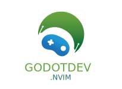
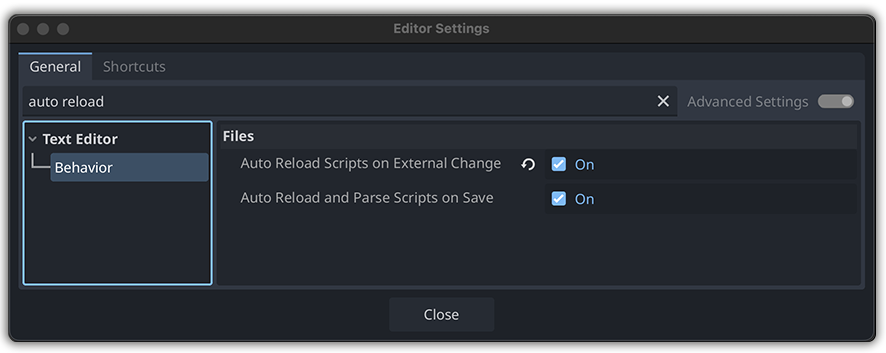
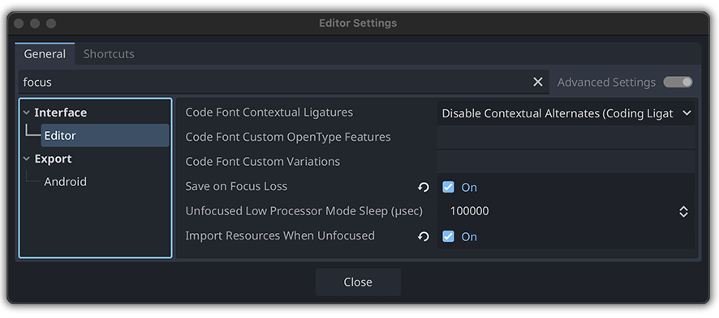

<div align="left">

  [](https://buymeacoffee.com/mathijs.bakker)

</div>
<div align="center"></div>

<div align="center">

[](https://buymeacoffee.com/mathijs.bakker)


[](https://github.com/Mathijs-Bakker/godotdev.nvim/actions/workflows/ci.yml)

</div>

# godotdev.nvim

A Neovim plugin for Godot 4 that brings GDScript/GDShader LSP, DAP debugging, and formatting to your external‑editor workflow.

This plugin helps you to set up:

- **LSP support** for GDScript and Godot shaders (`.gdshader` files)
- **Godot class docs** in Neovim, rendered from the official docs source as Markdown
- **Debugging** via `nvim-dap` for GDScript
- **Treesitter syntax highlighting** for Godot shader files
- **Automatic formatting** of `.gd` files using `gdformat`
- **Optional C# support** (user-managed LSP, plus debugging and tooling checks)
- **Built-in health checks** to verify environment, dependencies, and editor integration

While it is possible to configure Neovim manually for Godot development, this plugin **simplifies setup** and ensures a consistent, cross-platform workflow. It automatically configures LSP, debugging, formatting, and environment checks, so you can focus on writing game code rather than troubleshooting editor setup.

## Why godotdev.nvim?
- Turn Neovim into a first‑class external editor for Godot 4 projects.
- Get LSP features for GDScript/GDShader without manual wiring.
- Debug GDScript via DAP and validate setup with built‑in health checks.

## Features

Below is a quick overview of what you get out of the box:

### LSP Support
- Full GDScript language support (Go to definition, references, hover, rename, code actions, etc.)
- `.gdshader` syntax highlighting and language features via Treesitter
- Optional C# LSP support (user-managed `csharp-ls` or OmniSharp) for Godot projects with C# scripts

### Debugging (DAP)
- Debug GDScript directly from Neovim using `nvim-dap`
- Optional C# debugging via `netcoredbg`

### Formatting
- Automatic `.gd` file formatting using [`gdtoolkit`](https://pypi.org/project/gdtoolkit/)
- Reloads buffer after formatting for immediate feedback
- Recommended `.editorconfig` included for consistent indentation (4 spaces per indent)

### Health Checks
- `:checkhealth godotdev` validates:
  - Required dependencies: `nvim-lspconfig`, `nvim-dap`, `nvim-dap-ui`, `nvim-treesitter`
  - Godot editor LSP and debug servers
  - Floating Godot docs support (`curl` and active docs source configuration)
  - Optional C# tooling: `dotnet`, `csharp-ls`/OmniSharp, `netcoredbg`
  - Formatter: `gdformat` (with installation instructions)

### Editor Integration
- Commands to start or reconnect to Godot’s editor LSP:
  - `:GodotStartEditorServer`
  - `:GodotReconnectLSP`
- Commands to open Godot class reference docs:
  - `:GodotDocs [ClassName]`
  - `:GodotDocsFloat [ClassName]`
  - `:GodotDocsBuffer [ClassName]`
  - `:GodotDocsBrowser [ClassName]`
  - `:GodotDocsCursor`
- Automatic LSP attachment for Godot filetypes (`.gd`, `.gdshader`, `.gdresource`, optional `.cs`)
- Works cross-platform (macOS, Linux, Windows) with TCP or named pipes

### Optional C# Support
- Enable by setting `csharp = true` in `require("godotdev").setup()`
- C# LSP is configured by you (the plugin only checks that `csharp-ls` or OmniSharp is installed)
- Health checks and DAP integration included

## Requirements

- Neovim 0.11+
- Godot 4.x+ with TCP LSP enabled
- `nvim-lspconfig`
- `nvim-dap` and `nvim-dap-ui` for debugging
- `nvim-treesitter`
- Windows users must have [`ncat`](https://nmap.org/ncat/) in PATH
- Optional C# support requires (you manage the LSP configuration):
  - .NET SDK (dotnet)
  - C# LSP server (csharp-ls recommended or omnisharp)
  - netcoredbg debugger

## Installation (Lazy.nvim)

```lua
{
  'Mathijs-Bakker/godotdev.nvim',
  dependencies = { 'nvim-lspconfig', 'nvim-dap', 'nvim-dap-ui', 'nvim-treesitter' },
}
```
## Quickstart

1. Open your Godot project in Neovim
1. Start Godot editor with TCP LSP enabled (Editor Settings → Network → Enable TCP LSP server)
1. Open a `.gd` or `.gdshader` file
1. LSP will automatically attach
1. Use `<leader>rn` to rename, `gd` to go to definition, `gr` for references, etc.
1. Start debugging with DAP (Launch scene configuration)
1. Optional: Enable C# support by setting `csharp = true` in the plugin setup
1. Run `:checkhealth godotdev` at any time to verify plugin, LSP, debug server, and C# dependencies

## Configuration

### Optional settings
```lua
require("godotdev").setup({
  editor_host = "127.0.0.1", -- Godot editor host
  editor_port = 6005,        -- Godot LSP port
  debug_port = 6006,         -- Godot debugger port
  csharp = true,             -- Enable C# Installation Support
  autostart_editor_server = false, -- opt-in: start a Neovim server automatically on setup
  formatter = "gdformat",    -- "gdformat" | "gdscript-format" | false
  formatter_cmd = nil,       -- string or argv list, e.g. { "gdscript-format", "--check" }
  editor_server = {
    address = nil,           -- nil uses the current server or the platform default
    remove_stale_socket = true,
  },
  treesitter = {
    auto_setup = true,       -- convenience default; disable if you manage nvim-treesitter yourself
    ensure_installed = { "gdscript" },
  },
  docs = {
    renderer = "float",      -- default: open docs in a floating window
    fallback_renderer = "browser", -- nil | "browser" | "buffer"; browser is the only fetch-recovery fallback
    missing_symbol_feedback = "message", -- "message" | "notify"
    version = "stable",      -- e.g. "stable", "latest", "4.5"
    language = "en",
    source_ref = "master",   -- godot-docs git ref used for floating docs
    source_base_url = nil,   -- optional override for raw docs source
    timeout_ms = 10000,
    cache = {
      enabled = true,
      max_entries = 64,
    },
    float = {
      width = 0.8,
      height = 0.8,
      border = "rounded",
    },
    buffer = {
      position = "right",    -- "right" | "bottom" | "current"
      size = 0.4,
    },
  },
})
```

For formatter commands with flags, prefer an argv list:

```lua
formatter_cmd = { "gdscript-format", "--check" }
```

To disable autoformat-on-save entirely:

```lua
formatter = false
```

If you already manage `nvim-treesitter` yourself, you can disable plugin-managed setup:

```lua
treesitter = {
  auto_setup = false,
}
```

Default notes:
- `autostart_editor_server = false` is the safer default because starting a Neovim server is an external-editor concern and should be opt-in.
- `treesitter.auto_setup = true` stays enabled by default for convenience, but it is safe to turn off if you already configure `nvim-treesitter` yourself.
- `docs.fallback_renderer = "browser"` remains the default because browser fallback is the only option that can recover when rendered `.rst` docs cannot be fetched.

**Note:** This plugin does not define any keymaps by default, so it will not interfere with the standard DAP mappings. If you want custom keybindings, you can configure them yourself. For example, you could map `:GDebug` to `DapNew` to start one or more new debug sessions.

See `:help dap-mappings` and `:help dap-user-commands` for more details.

Additional references:
- [DAP documentation](https://github.com/mfussenegger/nvim-dap/blob/master/doc/dap.txt)
- [DAP README / usage](https://github.com/mfussenegger/nvim-dap/tree/master?tab=readme-ov-file#usage)

## Testing

Run the headless test suite:

```bash
nvim --headless -u NONE -i NONE -c "lua dofile('tests/run.lua')" -c qa
```

The same command runs in GitHub Actions on pushes to `master` and on pull requests.

For integration testing, also run the plugin inside Neovim against a real Godot project and verify editor server, docs, formatting, and debugging flows on your target platform.

### Optimize Godot editor for Neovim

Below are the recommended settings for configuring the Godot editor for optimal integration with Neovim as your external editor. To access these settings, make sure that the **Advanced Settings switch is enabled** at the top of the **Editor Settings dialog**.

- `Editor Settings > Text Editor > Behavior > Auto Reload Scripts on External Change`

   <details><summary>Show Screenshot -> Godot Editor Settings</summary></details>
- `Editor Settings > Interface > Editor > Save on Focus Loss`

  <details><summary>Show Screenshot -> Godot Editor Settings</summary></details>
- `Editor Settings > Interface > Editor > Import Resources When Unfocused`

  <details><summary>Show Screenshot -> Godot Editor Settings</summary></details>

### Open .gdscript/.gdshader from Godot in Neovim

When you click on a gdscript in Godot's FileSystem dock it doesn't open automatically in Neovim.
A [workaround](doc/neovim-external-editor-setup.md) is to to create a small script which launches the file in Neovim.

#### >> macOS/Linux
Complete instructions [here](doc/neovim-external-editor-setup.md)

If you start Neovim with `--listen` on macOS/Linux, use the documented `godotdev` wrapper instead of raw `nvim --listen ...` so stale socket files are cleaned up automatically after crashes. If your wrapper still reports `Neovim server already running at /tmp/godot.pipe` after you already quit, update its probe to use `nvr --nostart --servername ... --remote-expr '1'`.

#### >> Windows

1. Set Neovim to listen on a TCP port
   ```bash
   nvim --listen 127.0.0.1:6666
   ```
   --listen works with host:port on Windows.
1. Tell Godot to connect to that port
   In Godot, configure your external editor or plugin to connect to `127.0.0.1:6666`.
   Make sure the TCP port you choose is free and consistent between Neovim and Godot.

## Godot editor server

You can manually start the Neovim editor server used by Godot:

```vim
:GodotStartEditorServer
```

If Neovim is already running with `--listen`, the plugin will reuse that address instead of trying to start a second server.

Or automatically on plugin setup:

```lua
require("godotdev").setup({
  autostart_editor_server = true,
})
```

You can also pin a specific address:

```lua
require("godotdev").setup({
  autostart_editor_server = true,
  editor_server = {
    address = "/tmp/godot.pipe",
  },
})
```

On macOS/Linux, plugin-managed startup removes stale Unix socket files before retrying. This hardens `:GodotStartEditorServer`, but it does not affect a raw shell launch like `nvim --listen /tmp/godot.pipe`, because that failure happens before the plugin loads.

## Reconnect to Godot's LSP server

If the LSP disconnects or you opened a script before Neovim, run:

```vim
:GodotReconnectLSP
```

Reconnects **all Godot buffers** to the LSP.

## Godot class docs

Open the official Godot class reference from Neovim:

```vim
:GodotDocs Node
```

By default, `:GodotDocs` renders the docs in a floating window. You can also:

```vim
:GodotDocsFloat Node
:GodotDocsBuffer Node
:GodotDocsBrowser Node
:GodotDocsCursor
```

- If `:GodotDocs` is called without an argument, it uses the symbol under the cursor. Browser opening uses your configured system opener.
- Float and buffer rendering fetch the class reference source from `godotengine/godot-docs` with `curl`, converts the `.rst` to markdown, and displays that inside Neovim.
- `:GodotDocsBuffer` reuses a scratch markdown buffer so the docs stay open while you keep working.
- Configure persistent buffer placement with `docs.buffer.position = "right" | "bottom" | "current"` and `docs.buffer.size = 0.4`.
- Docs fetches and rendered markdown are cached in memory by default. Configure this with `docs.cache.enabled` and `docs.cache.max_entries`.
- The float and buffer renderers use the `markdown` filetype, so Markdown rendering plugins such as [MeanderingProgrammer/render-markdown.nvim](https://github.com/MeanderingProgrammer/render-markdown.nvim) can improve its presentation.
- `docs.fallback_renderer = "browser"` is the only fallback that can recover when the rendered `.rst` source cannot be fetched. A `buffer` fallback only changes presentation after rendering succeeds.
- When a symbol does not resolve to a Godot class page, the plugin shows a regular Neovim message by default. Set `docs.missing_symbol_feedback = "notify"` if you prefer notifications instead.

ℹ️ Recommended docs mapping:

```lua
vim.keymap.set("n", "gK", "<cmd>GodotDocs<cr>", { desc = "Godot docs" })
```

If you prefer a leader mapping instead:

```lua
vim.keymap.set("n", "<leader>gd", "<cmd>GodotDocs<cr>", { desc = "Godot docs" })
```

Why `gK`:

  - `K` is commonly LSP hover under cursor.
  - :white_check_mark: `gK` is close enough semantically to “keyword docs” and is usually free.
  - `gd`, `gD`, `gr` are already established LSP/navigation motions.
  - :white_check_mark: `<leader>gd` reads like `g`odot `d`ocs.
  - It fits well because `:GodotDocs` already defaults to the symbol under cursor.

## C# Installation Support

- Enable by setting `csharp = true` in `require("godotdev").setup()`
- C# LSP setup is user-managed; `:checkhealth godotdev` will only verify tooling is installed:
  - .NET SDK (`dotnet`)
  - C# LSP server (`csharp-ls` or `omnisharp`)
  - Debugger (`netcoredbg`)

## Autoformatting / Indentation

Godot expects **spaces, 4 per indent** (for both GDScript and C#).
This plugin automatically sets buffer options for `.gd` files.

Additionally, `.gd` files are autoformatted on save with [`gdtoolkit`](https://github.com/godotengine/gdtoolkit) unless you set `formatter = false`:

```vim
:w
```

Make sure `gdformat` is installed and in your PATH. If not, you will see a warning notification.

For more info on indentation: `:help godotdev-indent`

## Hiding Godot Project Files in oil.nvim and mini.files
Godot generates files and folders like `.uid`, `.import`, or `.godot/` that can clutter your file explorer.
You can hide them in both [oil.nvim](https://github.com/stevearc/oil.nvim) and [mini.files](https://github.com/nvim-mini/mini.nvim
) by filtering against their patterns.
[Show me how](doc/hide-files-in-file-explorers.md)

[](https://buymeacoffee.com/mathijs.bakker)
